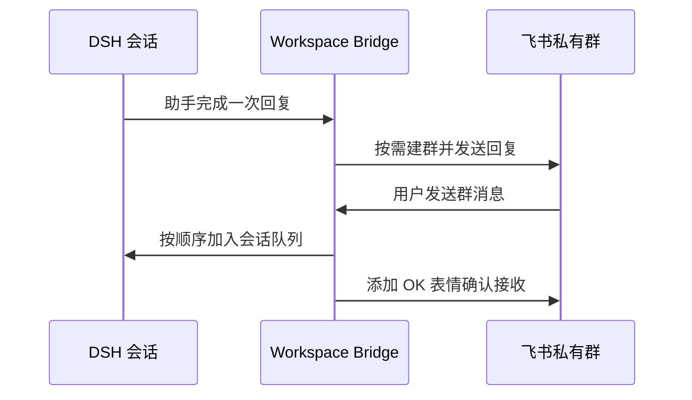

# Feishu Workspace Bridge

[](https://github.com/bandianliancha/feishu-workspace-bridge/actions/workflows/ci.yml)
[](LICENSE)

把 DSH 工作区与飞书群一一对应，并在 DSH 会话和飞书群之间实时双向同步消息。

插件只做三件事：

- 绑定一个飞书企业自建应用机器人。
- 工作区第一次产生需要同步的消息时，按需创建对应的飞书私有群并邀请你加入。
- 在当前 DSH 会话和对应飞书群之间双向同步消息。

## 工作方式



- 一个工作区最多绑定一个群。
- 群由机器人创建，默认是私有群，群信息仅允许群主或管理员修改。
- 工作区改名后，群名自动同步。
- 工作区删除后，对应飞书群自动解散。
- 如果群被手动解散，下一次同步时会自动重建。
- DSH 正在处理任务时，来自飞书的新消息使用 `queue` 模式排队，不会打断当前任务。
- Markdown 会使用飞书 `lark_md` 消息发送；长消息会分段发送，不会静默截断。
- 插件只消费实时事件，不读取或回放历史消息。

## 环境要求

- Node.js 20 或更高版本
- DeepSeek Harness（DSH）
- 飞书企业自建应用，并启用机器人能力

## 安装

```bash
dsh plugin --profile web add github:bandianliancha/feishu-workspace-bridge
```

安装后重启 DSH Web：

```bash
dsh web --no-open
```

打开 DSH 设置中的“飞书机器人”，填写：

- `App ID`
- `App Secret`
- 你的飞书 `Open ID`，格式为 `ou_...`

点击“保存并验证”。插件会在保存前检查机器人、事件订阅和全部必需权限。验证失败时不会覆盖已有配置。

已经保存过 App Secret 后，可以留空并重新执行权限验证。

## 飞书配置

在飞书开放平台完成以下配置。

### 1. 启用机器人

进入“添加应用能力”，添加机器人能力。

### 2. 使用长连接接收事件

在“事件与回调”中选择“使用长连接接收事件”，并订阅：

```text
im.message.receive_v1
```

本地运行不需要公网回调地址。

### 3. 开通应用身份权限

| 权限 | Scope | 用途 |
|---|---|---|
| 创建群聊 | `im:chat:create` | 首次同步时创建工作区群 |
| 获取与更新群组信息 | `im:chat` | 邀请成员、改群名、改为私有群和解散群 |
| 以应用身份发消息 | `im:message:send_as_bot` | 将 DSH 回复同步到群 |
| 接收群聊消息 | `im:message.group_msg` | 将群消息同步到 DSH |
| 添加消息表情回复 | `im:message.reactions:write_only` | 接收成功后添加 OK 表情 |
| 管理应用自身信息 | `application:application:self_manage` | 验证已发布事件订阅 |

插件不使用企业自定义群标签权限，因此无需申请群标签审核。

## 数据与安全

- App Secret 只保存在 DSH 服务端 SQLite 数据库中，不会返回浏览器。
- 凭证只保存一份，不会复制到各工作区记录。
- 默认数据库位置：`~/.dsh/feishu-workspace-bridge.sqlite`。
- 可通过 `FEISHU_WORKSPACE_BRIDGE_DB` 指定其他数据库路径。
- 入站和出站消息使用消息 ID 去重；去重记录保留 30 天后自动清理。
- HTTP 请求有 15 秒超时，飞书租户 token 会缓存并在过期前刷新。

## 群生命周期

群不会在创建空工作区时立即生成。只有该工作区第一次产生需要同步的助手消息时才会建群，避免创建大量空群。

已有工作区不需要手工迁移。插件启动后会检查已经绑定的群，补同步群名和私有群配置。

## 故障排查

### DSH 能发到飞书，但飞书消息进不了 DSH

检查：

1. 应用是否订阅 `im.message.receive_v1`。
2. 事件接收方式是否为长连接。
3. 最新应用版本是否已经发布。
4. DSH 启动日志中是否出现 `ws client ready`。
5. 机器人是否仍在对应工作区群内。

### 保存时提示权限不足

按照错误信息中的 scope 在飞书开发者后台开通权限，并发布新版本，然后再次点击“保存并验证”。

### 群消息已经进入 DSH，但没有 OK 表情

检查 `im:message.reactions:write_only` 是否已经随最新应用版本发布。

### 修改代码后 DSH 没有生效

DSH 只在启动时加载服务端插件。修改插件后需要重启 `dsh web`。

## 开发

```bash
npm install
npm run check
```

测试覆盖权限门禁、按需建群、私有群配置、成员邀请、双向消息、Markdown 分段、消息确认、工作区删除联动、凭证隔离和去重清理。

## 贡献

提交改动前请阅读 [CONTRIBUTING.md](CONTRIBUTING.md)，安全问题请按照 [SECURITY.md](SECURITY.md) 私下报告。

## License

[MIT](LICENSE) © bandianliancha
